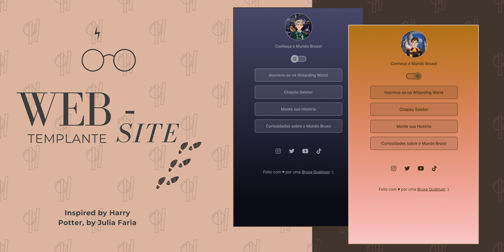

# Website Template

Modelo de Website usando como inspiração Harry Potter.

## :thought_balloon: Visão Geral

Projeto simples utilizando HTML, CSS e JavaScript para encontrar principais sites de Harry Potter.

## :eyes: Como Visualizar

Abra o arquivo `index.html` no seu navegador para visualizar o site.

## :computer: Tecnologias

Esse projeto foi desenvolvido com as seguintes tecnologias:

- HTML e CSS
- JavaScript
- Git e Github

## :grey_exclamation: Estrutura de Arquivos
├── index.html

├── style.css

└── script.js

## :memo: Licença

Esse projeto está sob a licença MIT.

## :love_letter: Contribuição

Contribuições são sempre bem-vindas!

## :v: Créditos

Feito com ♥ by Julia Faria :wave: