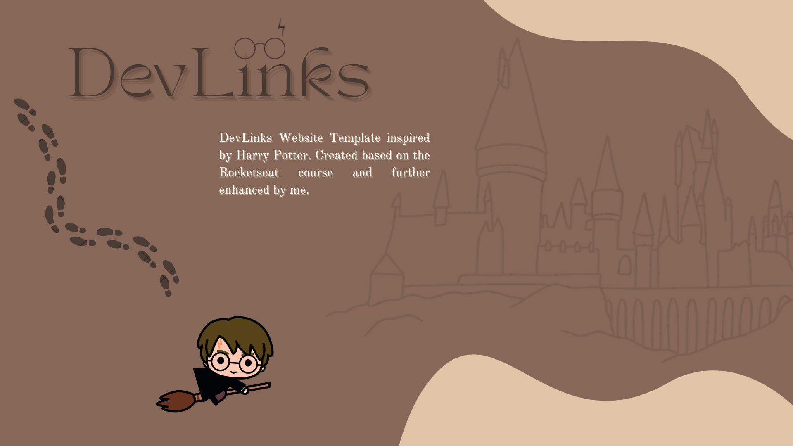

# Website Template

## Visão Geral

Projeto simples utilizando HTML, CSS e JavaScript para [Encontrar principais sites de Harry Potter].

## Como Visualizar

Abra o arquivo `index.html` no seu navegador para visualizar o site.

## Tecnologias

Esse projeto foi desenvolvido com as seguintes tecnologias:

- HTML e CSS
- JavaScript
- Git e Github

## Estrutura de Arquivos
├── index.html
├── style.css
└── script.js

## :memo: Licença

Esse projeto está sob a licença MIT.

## Contribuição

Contribuições são sempre bem-vindas!

## Créditos

Feito com ♥ by Julia Faria :wave: